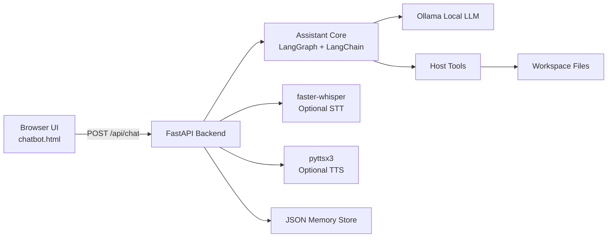
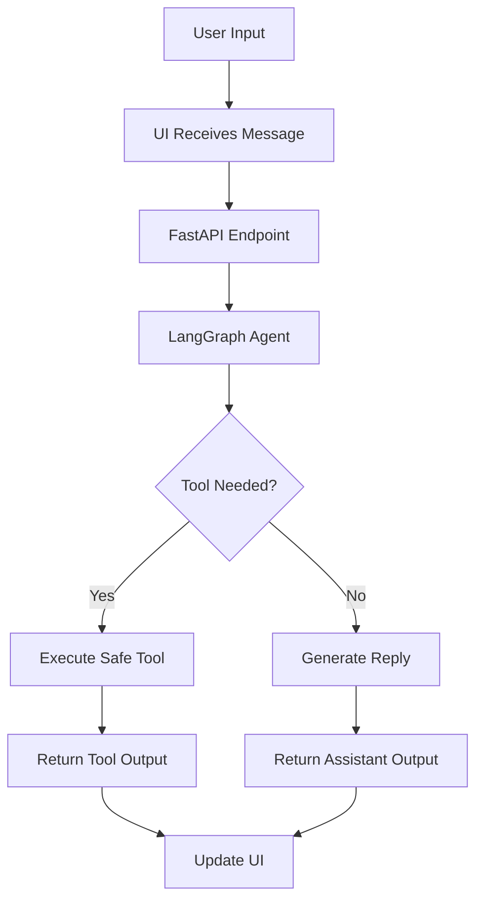

# Lofty Terminal — Local-First AI Assistant


[](https://www.python.org/)
[](https://fastapi.tiangolo.com/)
[](https://ollama.com/)
[](https://langchain-ai.github.io/langgraph/)
[](https://python.langchain.com/)
[](https://www.microsoft.com/windows)

**Lofty** is a local-first AI assistant built to feel fast, private, and highly usable. It combines a FastAPI backend, a cinematic terminal-style web UI, a tool-aware agent flow, optional voice input, and local memory to create a complete assistant system that runs on your machine.

---

## Project Summary

Lofty is a practical desktop-style assistant with a strong developer focus. It can chat, call tools, manage files, open applications, and support optional speech-to-text and text-to-speech. The interface is intentionally minimal and terminal-inspired, while the backend remains modular and easy to extend.

This project is designed for real productivity use, not just demo interaction. The assistant can be connected to local models through Ollama, and the tool graph can safely execute approved host actions such as app launching, file operations, and browser actions.

---

## Core Concepts

* Local-first assistant with no dependency on cloud LLMs by default
* FastAPI backend for routing, UI delivery, and assistant endpoints
* Ollama integration for running local models
* LangGraph orchestration for tool-aware assistant behavior
* LangChain integration for model and tool bindings
* JSON-backed memory for persistence across sessions
* Optional voice interaction using faster-whisper
* Optional spoken replies using pyttsx3
* Safe host tools with workspace restrictions and confirmation flow
* Modular backend wrappers for cleaner expansion
* Responsive frontend with cards, voice controls, and theme support

---

## Feature Highlights

* Conversational assistant interface with terminal-style UI
* Tool-aware model flow for actionable requests
* Open applications on Windows and other supported environments
* Read and write files in a controlled workspace
* Web link launching and command execution support
* Memory storage for preferences and session context
* Optional voice interaction using faster-whisper
* Optional spoken replies using pyttsx3
* Modular backend wrappers for cleaner expansion
* Responsive frontend with cards, voice controls, and theme support
* Privacy-friendly local model execution
* Safe tool execution with confirmation before risky actions

---

## Sticker Skills

Use these as visual skill stickers in your README, banner, or project gallery:

[]()
[]()
[]()
[]()
[]()
[]()
[]()
[]()
[]()
[]()
[]()
[]()

---

## Achievement Badges

Use these badges to show the project level and technical progress:

[]()
[]()
[]()
[]()
[]()
[]()
[]()
[]()

---

## Technology Stack

### Backend

* Python
* FastAPI
* Uvicorn
* LangChain
* LangGraph
* Ollama

### Voice

* faster-whisper
* pyttsx3

### UI

* HTML
* CSS
* JavaScript
* Terminal-inspired frontend layout

### Storage

* JSON memory file
* Workspace-scoped file operations

---

## Architecture



---

## Workflow



---

## Assistant Flow

1. User types or speaks.
2. Frontend sends the request to FastAPI.
3. The assistant core builds context from memory.
4. Ollama generates a response or tool call.
5. LangGraph routes the request through the correct node.
6. Safe tools are executed if needed.
7. The final response is returned to the UI.
8. Optional TTS speaks the response.

---

## Components

### API Layer

Responsible for:

* chat endpoint handling
* voice endpoints
* static file delivery
* frontend serving
* assistant orchestration

### Assistant Core

Responsible for:

* model binding
* message routing
* tool execution
* context preparation
* response generation

### Tool Layer

Responsible for:

* opening applications
* reading and writing files
* launching URLs
* workspace-safe actions
* optional shell operations

### Memory Layer

Responsible for:

* saving preferences
* session context
* user settings
* reusable state across sessions

### UI Layer

Responsible for:

* terminal-style chat interface
* clickable controls
* voice buttons
* theme support
* intro video support

---

## Core Concepts Explained

### Local Model Execution

Lofty is designed to run with Ollama so the assistant can operate locally without requiring cloud inference for basic use cases.

### Tool Graph

The tool graph allows the assistant to decide when to answer directly and when to call a tool for actions such as opening a file, launching an app, or interacting with the system.

### Memory

Preferences and key session details are stored in a JSON file so the assistant can become more personalized over time.

### Safety

Sensitive actions are gated by confirmation and workspace rules to reduce accidental file or system modifications.

### Voice Support

Voice input and spoken replies are optional modules that can be enabled when the needed packages are installed.

### Productivity Core

The assistant is designed to reduce manual switching between apps, files, and browser tasks by turning natural language into direct actions.

### Human-Like Interaction

The UI and voice loop are built to feel present, responsive, and continuous instead of static or generic.

---

## Product Goals

* Make the assistant feel local, private, and fast
* Provide a real utility layer for desktop productivity
* Support natural language commands for workflows
* Keep the codebase modular and easy to maintain
* Present the project like a polished product, not a toy demo

---

## Visual Assets

Add your project visuals here:

* `assets/banner.jpg` — main project banner
* `assets/intro.mp4` — intro video for the terminal UI
* `assets/hero-shot.png` — main product screenshot
* `assets/assistant-state.png` — idle assistant screen
* `assets/speaking-state.gif` — speaking animation
* `assets/screens/` — UI screenshots
* `assets/badges/` — modern achievement badges
* `assets/stickers/` — digital stickers and skill tags
* `assets/videos/` — project videos and clips
* `assets/covers/` — video/image cover art

### Suggested video placements

* one short hero video near the overview
* one assistant state loop near the features
* one workflow demo clip near the architecture section
* one voice demo clip near the voice section

### Suggested image placements

* banner image at the top
* one clean screenshot of the UI
* one architecture visual
* one feature collage
* one sticker sheet or badge sheet

---

## Media Gallery

Use this section to show your project visually:

### Project Video

Place your main product video here:

```html
<video controls autoplay muted loop playsinline>
  <source src="assets/videos/lofty-demo.mp4" type="video/mp4">
</video>
```

### Project Image

Place your main project image here:

```html

```

### Assistant States

Show the assistant in different modes:

* idle portrait
* listening portrait
* speaking video
* tool execution screen
* confirmation screen

---

## Setup

### 1. Install dependencies

```bash
pip install -r requirements_lofty_backend.txt
```

### 2. Install Ollama

Download and install Ollama, then pull a model:

```bash
ollama pull qwen3:4b
```

### 3. Run the backend

```bash
uvicorn lofty_backend_enhanced:app --reload --host 0.0.0.0 --port 8000
```

Or:

```bash
python lofty_backend_enhanced.py
```

### 4. Open the UI

Open your browser at:

```text
http://127.0.0.1:8000/
```

---

## Testing

### Syntax checks

```bash
python -m py_compile lofty_backend_enhanced.py tools.py
```

### Import smoke test

```bash
python -c "import lofty_backend_enhanced, tools; print('imports ok')"
```

### Voice stack check

```bash
python -c "import sounddevice, faster_whisper, numpy, scipy; print('voice ok')"
```

### UI asset check

```bash
python -c "from pathlib import Path; print(Path('assets/banner.jpg').exists())"
```

---

## Safety Notes

* File writing is restricted to the approved workspace.
* Risky actions should require confirmation.
* Shell commands should be limited and reviewed.
* Tool execution should never silently perform destructive actions.
* Model responses should not be trusted for system-critical actions without validation.

---

## Directory Structure

```text
project/
├── lofty_backend_enhanced.py
├── tools.py
├── lofty_backend/
│   ├── __init__.py
│   ├── assistant.py
│   ├── config.py
│   ├── memory.py
│   └── utils.py
├── templates/
│   └── chatbot.html
├── assets/
│   ├── banner.jpg
│   ├── intro.mp4
│   ├── hero-shot.png
│   ├── assistant-state.png
│   ├── speaking-state.gif
│   ├── videos/
│   ├── screens/
│   ├── stickers/
│   └── badges/
├── lofty_memory.json
├── requirements_lofty_backend.txt
└── README.md
```

---

## Troubleshooting

### Ollama not connecting

Make sure Ollama is running locally and the base URL matches your configuration.

### Voice not ready

Install the voice packages and confirm that the app and terminal are using the same Python interpreter.

### App launch fails

Some applications on Windows may require exact executable paths rather than aliases.

### File errors

Ensure the file exists inside the workspace and that the assistant is allowed to access it.

### Media not showing

Confirm the asset paths are correct and the files exist in the expected folders.

---

## Roadmap

* Split the backend into smaller modules
* Add more tool categories
* Expand memory capabilities
* Improve voice flow and latency
* Add richer UI states and themes
* Add tests and CI checks
* Package for desktop distribution
* Improve screenshot, banner, sticker, and badge assets
* Add more workflow demos and product media
* Add a polished landing page for the project

---

## Why This Project Matters

Lofty is built as a serious local assistant system that combines model orchestration, tools, voice, memory, and a polished interface. It is designed to demonstrate product thinking, backend engineering, automation logic, and strong UI and UX direction in one project.

It also shows practical implementation of local-first AI, safe tool execution, and system-level productivity workflows.

---

## License

Choose a license for the repository and add a `LICENSE` file. Common options:

* MIT
* Apache-2.0

---

## Credits

Built with:

* Ollama
* LangChain
* LangGraph
* FastAPI
* faster-whisper
* pyttsx3
* Python

---

## Final Note

Lofty is a local AI assistant built for practical productivity, system automation, and a polished user experience.
