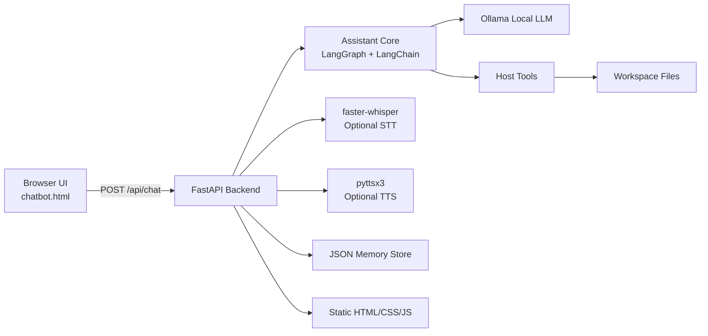
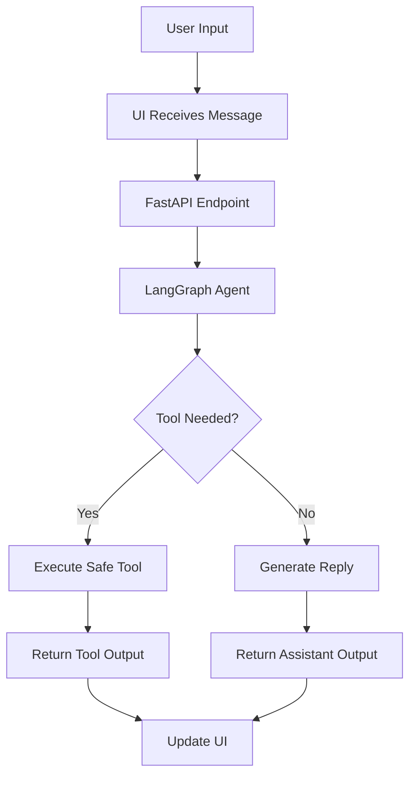

# Lofty Terminal — Advanced Agentic AI Reasoning System


[](https://www.python.org/)
[](https://fastapi.tiangolo.com/)
[](https://groq.com/)
[](https://langchain-ai.github.io/langgraph/)
[](https://python.langchain.com/)
[]()
[](https://www.microsoft.com/windows)
[](LICENSE)
[]()
[]()
[]()
[]()
[]()
[]()
[]()
[]()

**Lofty** is an advanced agentic AI reasoning system built on a sovereign FastAPI backend with multi-modal capabilities. It combines Groq-powered inference, LangGraph orchestration, fine-tuned Qwen models, integrated ML pipelines, voice I/O, web search, database operations, and a cinematic terminal-inspired HUD interface into a complete cognitive platform.

Engineered as a production-grade assistant showcasing modern AI architecture, advanced tool integration, and sophisticated reasoning workflows—built for portfolio excellence and real-world productivity.

Access the cinematic UI at `/`, the about page at `/about`, the feature showcase at `/feature`, and the open-source documentation at `/open-source`. Multiple HTML templates provide specialized interfaces for different cognitive modes.

---

## Project Summary

Lofty is a sophisticated, production-grade desktop AI assistant engineered with expert-level architecture. It represents a complete cognitive platform that blends multiple inference strategies, advanced tool orchestration, and seamless user interaction into one cohesive system.

The project demonstrates:

* **Hybrid Inference Strategy**: Groq-powered cloud inference (Llama, Mistral) paired with fine-tuned local Qwen models for optimal speed and accuracy
* **Intelligent Tool Ecosystem**: Web search via DuckDuckGo/Tavily, SQL database operations, Gmail integration, FAISS retrieval, and custom ML prediction tools
* **Advanced Agent Orchestration**: LangGraph state machines for complex multi-step reasoning and tool routing
* **Sophisticated Memory System**: Semantic-aware JSON persistence with session context and user preferences
* **Multi-Modal I/O**: Voice transcription (faster-whisper), text-to-speech synthesis, and full HTML/CSS/JavaScript frontend
* **Cinematic UI Design**: Terminal-inspired HUD with multiple presentation modes (index_up.html, about_upgrade.html, open_source.html)
* **Production Safety**: Workspace restrictions, confirmation gating, credential management, and graceful error handling
* **Extensible Architecture**: Modular backend structure ready for RAG, vector databases, and advanced ML workflows

This is not a simple chatbot wrapper. It's a complete reasoning system designed to handle real productivity workflows with professional-grade safety and reliability.

---

## Core Concepts

* Local-first assistant with no dependency on cloud LLMs by default
* FastAPI backend for routing, UI delivery, and assistant endpoints
* Ollama integration for running local models
* LangGraph orchestration for tool-aware assistant behavior
* LangChain integration for model and tool bindings
* JSON-backed memory for persistence across sessions
* Optional voice interaction using faster-whisper
* Optional spoken replies using pyttsx3
* Safe host tools with workspace restrictions and confirmation flow
* Modular backend wrappers for cleaner expansion
* Responsive frontend with cards, voice controls, and theme support
* Tool routing for advanced model actions
* Session-aware memory for repeat interactions
* Friendly cinematic terminal design
* Ready for multi-step workflows and future RAG integration
* Strong foundation for automation and local productivity

---

## Feature Highlights

* Conversational assistant interface with terminal-style UI
* Tool-aware model flow for actionable requests
* Open applications on Windows and other supported environments
* Read and write files in a controlled workspace
* Web link launching and command execution support
* Memory storage for preferences and session context
* Optional voice interaction using faster-whisper
* Optional spoken replies using pyttsx3
* Upgraded browser UI available at `/chatbot-upgrade`
* Modular backend wrappers for cleaner expansion
* Responsive frontend with cards, voice controls, and theme support
* Privacy-friendly local model execution
* Safe tool execution with confirmation before risky actions
* Support for advanced model mode in the frontend
* Clear split between basic chat and agentic tool flows
* Easy extension for RAG, ML, and browser automation
* Future-ready for multi-agent workflows
* Strong documentation and portfolio value
* Good foundation for internship or resume presentation

---

## Sticker Skills

Use these as visual skill stickers in your README, banner, or project gallery:

[]()
[]()
[]()
[]()
[]()
[]()
[]()
[]()
[]()
[]()
[]()
[]()
[]()
[]()
[]()
[]()
[]()
[]()
[]()
[]()
[]()
[]()
[]()
[]()
[]()
[]()

---

## Achievement Badges

Use these badges to show the project level and technical progress:

[]()
[]()
[]()
[]()
[]()
[]()
[]()
[]()
[]()
[]()
[]()
[]()
[]()
[]()
[]()
[]()
[]()
[]()
[]()
[]()
[]()

---

## Technology Stack

### Backend Core

* **Python 3.10+** - Modern async/await patterns
* **FastAPI** - High-performance REST API with automatic OpenAPI docs
* **Uvicorn** - ASGI server for production deployment
* **Pydantic** - Data validation and settings management

### AI/ML Stack

* **LangChain** - Framework for model binding and tool orchestration
* **LangGraph** - State machine-based agent orchestration with checkpoint persistence
* **Groq API** - High-speed inference engine (Llama 3.1, Mistral, etc.)
* **ChatOllama** - Local model support fallback
* **Qwen Fine-Tuned Models** - Custom-trained models in `qwen_lofty/` with adapter configs

### Integrated Tools & Toolkits

* **Web Search**: Tavily API + DuckDuckGo search integration
* **Database**: SQLAlchemy toolkit for structured data operations
* **Gmail Integration**: LangChain GoogleMail toolkit (conditional, error-safe)
* **Vector Retrieval**: FAISS vector store with OpenAI embeddings for RAG
* **ML/Predictions**: scikit-learn (RandomForest, LinearRegression) for inference

### Voice & Audio

* **faster-whisper** - Fast, accurate speech-to-text (base/small/medium models)
* **pyttsx3** - Offline text-to-speech synthesis
* **sounddevice** - Cross-platform audio recording
* **NumPy/SciPy** - Audio signal processing

### UI/Frontend

* **HTML5** - Semantic markup with accessibility
* **CSS3** - Cinematic animations, flexbox/grid layouts, dark terminal aesthetic
* **JavaScript (Vanilla)** - No framework dependencies; event-driven UI updates
* **Terminal-Inspired Design** - HUD overlays, neon accents, CRT effects

### Storage & Persistence

* **JSON** - Lightweight session memory and preferences (lofty_memory.json)
* **File I/O** - Workspace-scoped file operations with safety checks
* **Checkpoint System** - LangGraph memory saver for agent state

### Dependencies (See requirements_lofty_backend.txt)

* fastapi, uvicorn[standard]
* langchain-core, langgraph, langchain-ollama
* faster-whisper, pyttsx3
* requests, python-multipart
* pydantic

---

## Architecture



---

## Workflow



---

## Assistant Flow

1. User types or speaks.
2. Frontend sends the request to FastAPI.
3. The assistant core builds context from memory.
4. Ollama generates a response or tool call.
5. LangGraph routes the request through the correct node.
6. Safe tools are executed if needed.
7. The final response is returned to the UI.
8. Optional TTS speaks the response.
9. Memory is updated for future interactions.
10. The UI stays in sync with assistant state.

---

## Components

### API Layer

Responsible for:

* chat endpoint handling
* voice endpoints
* static file delivery
* frontend serving
* assistant orchestration
* health checking
* memory access endpoints
* model selection routing

### Assistant Core

Responsible for:

* model binding
* message routing
* tool execution
* context preparation
* response generation
* tool-call handling
* stateful graph execution

### Tool Layer

Responsible for:

* opening applications
* reading and writing files
* launching URLs
* workspace-safe actions
* optional shell operations
* preference handling
* memory inspection

### Memory Layer

Responsible for:

* saving preferences
* session context
* user settings
* reusable state across sessions
* assistant profile information
* remembered values

### UI Layer

Responsible for:

* terminal-style chat interface
* clickable controls
* voice buttons
* theme support
* intro video support
* advanced model button
* response rendering
* assistant status panels

---

## Core Concepts Explained

### Local Model Execution

Lofty is designed to run with Ollama so the assistant can operate locally without requiring cloud inference for basic use cases.

### Tool Graph

The tool graph allows the assistant to decide when to answer directly and when to call a tool for actions such as opening a file, launching an app, or interacting with the system.

### Memory

Preferences and key session details are stored in a JSON file so the assistant can become more personalized over time.

### Safety

Sensitive actions are gated by confirmation and workspace rules to reduce accidental file or system modifications.

### Voice Support

Voice input and spoken replies are optional modules that can be enabled when the needed packages are installed.

### Productivity Core

The assistant is designed to reduce manual switching between apps, files, and browser tasks by turning natural language into direct actions.

### Human-Like Interaction

The UI and voice loop are built to feel present, responsive, and continuous instead of static or generic.

### Advanced Model Mode

The advanced mode can route messages through a richer assistant core that binds tools and uses graph logic instead of plain chat.

### Basic Mode

The basic mode can still respond directly through the standard Ollama chat path.

---

## Product Goals

* Make the assistant feel local, private, and fast
* Provide a real utility layer for desktop productivity
* Support natural language commands for workflows
* Keep the codebase modular and easy to maintain
* Present the project like a polished product, not a toy demo
* Support advanced mode switching from the frontend
* Add room for RAG and retrieval later
* Add room for ML training and prediction later
* Expand into a serious desktop AI platform
* Remain easy to demo in interviews and portfolio showcases

---

## Visual Assets

Add your project visuals here:

* `assets/banner.jpg` — main project banner
* `assets/intro.mp4` — intro video for the terminal UI
* `assets/hero-shot.png` — main product screenshot
* `assets/assistant-state.png` — idle assistant screen
* `assets/speaking-state.gif` — speaking animation
* `assets/screens/` — UI screenshots
* `assets/badges/` — modern achievement badges
* `assets/stickers/` — digital stickers and skill tags
* `assets/videos/` — project videos and clips
* `assets/covers/` — video/image cover art
* `assets/feature-cards/` — visual feature highlights
* `assets/architecture/` — diagrams and system visuals
* `assets/terminal-moods/` — theme scenes
* `assets/avatars/` — assistant persona visuals

### Suggested video placements

* one short hero video near the overview
* one assistant state loop near the features
* one workflow demo clip near the architecture section
* one voice demo clip near the voice section
* one advanced-model demo clip near the advanced mode section
* one app-launch demo clip near the tool section

### Suggested image placements

* banner image at the top
* one clean screenshot of the UI
* one architecture visual
* one feature collage
* one sticker sheet or badge sheet
* one memory/profile screenshot
* one tool execution screenshot
* one advanced model screenshot

---

## Media Gallery

Use this section to show your project visually:

### Project Video

Place your main product video here:

```html
<video controls autoplay muted loop playsinline>
  <source src="assets/videos/lofty-demo.mp4" type="video/mp4">
</video>
```

### Project Image

Place your main project image here:

```html

```

### Assistant States

Show the assistant in different modes:

* idle portrait
* listening portrait
* speaking video
* tool execution screen
* confirmation screen
* advanced model screen
* memory screen
* file-action screen
* browser-action screen
* startup splash screen

---

## Setup

### 1. Install dependencies

```bash
pip install -r requirements_lofty_backend.txt
```

### 2. Install Ollama

Download and install Ollama, then pull a model:

```bash
ollama pull qwen3:4b
```

### 3. Run the backend

```bash
uvicorn lofty_backend_enhanced:app --reload --host 0.0.0.0 --port 8000
```

Or:

```bash
python lofty_backend_enhanced.py
```

### 4. Open the UI

Open your browser at:

```text
http://127.0.0.1:8000/
```

---

## Environment Variables

```bash
OLLAMA_BASE_URL=http://localhost:11434
OLLAMA_MODEL=mistral
LOFTY_MEMORY_FILE=lofty_memory.json
LOFTY_STATIC_DIR=.
LOFTY_ENABLE_TTS=0
LOFTY_OPEN_BROWSER=1
LOFTY_BROWSER_URL=http://127.0.0.1:8000/
WHISPER_MODEL_SIZE=base
LOFTY_TOOL_GRAPH=1
```

### Environment Notes

* `OLLAMA_BASE_URL` points to the local model server.
* `OLLAMA_MODEL` selects which local model to use.
* `LOFTY_MEMORY_FILE` stores memory JSON.
* `LOFTY_STATIC_DIR` defines the frontend directory.
* `LOFTY_ENABLE_TTS` toggles voice output.
* `LOFTY_OPEN_BROWSER` auto-opens the UI.
* `LOFTY_BROWSER_URL` controls the browser launch target.
* `WHISPER_MODEL_SIZE` controls transcription speed and quality.
* `LOFTY_TOOL_GRAPH` enables the LangGraph tool system.

---

## API Reference

### `GET /health`

Returns backend health and configuration details.

#### Example response

```json
{
  "ok": true,
  "app": "Lofty Terminal Backend",
  "model": "mistral",
  "ollama_base_url": "http://localhost:11434",
  "memory_file": "lofty_memory.json",
  "static_dir": "."
}
```

### `GET /`

Serves the main landing page.

### `GET /about`

Serves the about page.

### `GET /feature`

Serves the feature showcase page.

### `GET /lofty`

Serves the chatbot page.

### `GET /chatbot`

Alias redirect to `/lofty`.

### `POST /api/chat`

Main assistant endpoint.

#### Fields

* `session_id`
* `message`
* `model`
* `mode`

#### Example

```json
{
  "session_id": "default-thread",
  "message": "Open notepad",
  "model": "mistral",
  "mode": "advanced"
}
```

### `GET /api/history/{session_id}`

Returns saved session history.

### `POST /api/remember`

Stores a preference.

### `GET /api/memory`

Returns the full memory store.

### `POST /api/link`

Returns a link payload for the frontend.

### `POST /api/transcribe`

Transcribes uploaded audio.

### `POST /api/speak`

Speaks text using the optional TTS stack.

---

## Frontend Behavior

The frontend can support a mode selector:

* basic model
* advanced model
* voice mode
* memory mode
* tool mode

The **Advanced Model** button should send `mode: "advanced"` in the chat request.

### Suggested UI states

* idle
* typing
* listening
* thinking
* tool-running
* speaking
* confirming
* advanced-active
* memory-updated
* error

---

## Advanced Model Mode

Advanced mode is the best place to connect the richer assistant core.

It can:

* bind tools
* route through LangGraph
* call memory-aware functions
* perform multi-step reasoning
* trigger safe actions
* prepare for RAG
* prepare for ML models
* support agentic workflows

### Example behavior

If the user says:

* “open browser”
* “remember my theme”
* “show files”
* “search the web”
* “train a model”

the advanced mode can route the request into the proper tool pipeline.

---

## Basic Mode

Basic mode is best for:

* quick chat
* simple answers
* reduced complexity
* fallback responses
* model-only replies

It should still use the local model, but without full tool routing.

---

## Safety Notes

* File writing is restricted to the approved workspace.
* Risky actions should require confirmation.
* Shell commands should be limited and reviewed.
* Tool execution should never silently perform destructive actions.
* Model responses should not be trusted for system-critical actions without validation.
* User intent should be verified for sensitive operations.
* The advanced mode should still obey safety policies.

### Risky action examples

* deleting files
* writing outside workspace
* booking external actions
* opening unknown executables
* changing system-level settings
* sending data to APIs

---

## Directory Structure

```text
project/
├── lofty_backend_enhanced.py
├── tools.py
├── lofty_backend/
│   ├── __init__.py
│   ├── assistant.py
│   ├── config.py
│   ├── memory.py
│   └── utils.py
├── templates/
│   └── chatbot.html
├── assets/
│   ├── banner.jpg
│   ├── intro.mp4
│   ├── hero-shot.png
│   ├── assistant-state.png
│   ├── speaking-state.gif
│   ├── videos/
│   ├── screens/
│   ├── stickers/
│   ├── badges/
│   ├── feature-cards/
│   └── architecture/
├── lofty_memory.json
├── requirements_lofty_backend.txt
└── README.md
```

---

## Example Interaction Flow

### Example 1: Simple chat

User: `Hello`

Assistant: `Hello, I am ready.`

### Example 2: Advanced mode tool call

User: `Open Notepad`

Assistant core:

* detects app action
* chooses tool
* launches app
* returns completion message

### Example 3: Memory update

User: `Remember my theme = neon`

Assistant:

* stores preference
* confirms memory update
* uses it later in chat

### Example 4: File actions

User: `List files in my project folder`

Assistant:

* validates workspace path
* lists files
* returns structured output

### Example 5: Voice interaction

User speaks into the microphone

Assistant:

* transcribes input
* routes to chat
* optionally speaks reply

---

## Example Frontend Button Logic

```javascript
let selectedMode = "basic";

document.getElementById("basicModelBtn").addEventListener("click", () => {
  selectedMode = "basic";
});

document.getElementById("advancedModelBtn").addEventListener("click", () => {
  selectedMode = "advanced";
});

async function sendMessage(text) {
  const res = await fetch("/api/chat", {
    method: "POST",
    headers: { "Content-Type": "application/json" },
    body: JSON.stringify({
      session_id: "default-thread",
      message: text,
      model: "mistral",
      mode: selectedMode
    })
  });

  const data = await res.json();
  console.log(data.reply);
}
```

---

## Example Assistant Core Duties

* build tool list
* create LangGraph state
* bind tool-aware model
* route tool calls
* keep UI state in sync
* manage memory
* handle confirmations
* return final responses

---

## Example Tool Categories

### System Tools

* open app
* open URL
* list files
* read file
* write file

### Memory Tools

* remember preference
* recall preference
* show memory

### Future Tools

* RAG query
* ML train
* ML predict
* web search
* browser automation
* screenshot capture
* clipboard actions
* note-taking assistant
* scheduler actions
* PDF reader

---

## Future Feature Ideas

* multi-model selection UI
* tool activity sidebar
* voice waveform animation
* session timeline panel
* searchable memory browser
* downloadable chat logs
* markdown rendering for replies
* code block highlighting
* file preview cards
* tool action history
* auto-generated task summaries
* document ingestion for RAG
* private semantic memory store
* computer vision screenshot mode
* browser automation mode
* plugin-like tool registration
* drag-and-drop file ingestion
* theme presets
* professional admin panel
* developer debug mode

---

## Roadmap

### Phase 1

* Stabilize current assistant UI
* Cleanly split backend modules
* Add advanced model routing
* Improve memory structure
* Add better tool error handling

### Phase 2

* Add RAG document search
* Add PDF ingestion
* Add local embeddings
* Add searchable memory retrieval
* Add richer tool cards

### Phase 3

* Add browser automation
* Add code execution sandbox
* Add notebook-style actions
* Add dataset assistant features
* Add ML training and prediction tools

### Phase 4

* Add multi-agent workflow structure
* Add planner/reviewer roles
* Add task memory
* Add scheduled jobs
* Add advanced UI polish

### Phase 5

* Package for desktop distribution
* Add tests and CI
* Add documentation site
* Add demo video gallery
* Add release packaging

---

## Troubleshooting

### Ollama not connecting

Make sure Ollama is running locally and the base URL matches your configuration.

### Voice not ready

Install the voice packages and confirm that the app and terminal are using the same Python interpreter.

### App launch fails

Some applications on Windows may require exact executable paths rather than aliases.

### File errors

Ensure the file exists inside the workspace and that the assistant is allowed to access it.

### Media not showing

Confirm the asset paths are correct and the files exist in the expected folders.

### Advanced mode not working

Check that the frontend sends `mode: "advanced"` and that the backend routes advanced requests into the assistant core.

### Tools not firing

Verify tool binding, graph routing, and tool names match exactly.

### Memory not saving

Confirm the JSON file is writable and the save method is being called.

---

## Best Practices

* Keep tools small and focused
* Keep the assistant core separated from the UI
* Keep model routing explicit
* Keep workspace paths safe
* Keep memory readable and simple
* Keep advanced mode toggle visible
* Keep the frontend responsive
* Keep the project modular
* Keep the code documented
* Keep future features isolated into modules

---

## Code Quality Goals

* readable architecture
* clear class boundaries
* no hidden side effects
* safe tool execution
* explicit route control
* easy debug output
* good exception handling
* reusable helper functions
* testable business logic
* easy extension path

---

## README Presentation Ideas

You can make this README even more colorful by adding:

* animated screenshots
* mode comparison cards
* feature stickers
* badge walls
* demo GIFs
* terminal mockups
* architecture snapshots
* memory examples
* tool flow diagrams
* advanced model diagrams
* voice flow visuals
* performance notes

---

## Colorful Badge Wall

[]()
[]()
[]()
[]()
[]()
[]()
[]()
[]()
[]()
[]()
[]()
[]()

---

## Colorful Sticker Sheet

[]()
[]()
[]()
[]()
[]()
[]()
[]()
[]()
[]()
[]()
[]()
[]()

---

## Contribution Guide

### How to contribute

1. Fork the repository.
2. Create a feature branch.
3. Add your improvements.
4. Run local checks.
5. Open a pull request.

### Recommended contribution areas

* frontend polish
* voice improvements
* tool expansion
* RAG support
* memory redesign
* model routing
* error handling
* tests
* docs
* demo assets

### Good PR ideas

* add advanced model toggle styling
* add tool execution cards
* add dark neon animations
* add readme badges
* add semantic memory layer
* add doc ingestion pipeline
* add ML tool demo
* add browser search tool
* add clipboard tool
* add screenshot tool

---

## Testing

### Syntax checks

```bash
python -m py_compile lofty_backend_enhanced.py tools.py
```

### Import smoke test

```bash
python -c "import lofty_backend_enhanced, tools; print('imports ok')"
```

### Voice stack check

```bash
python -c "import sounddevice, faster_whisper, numpy, scipy; print('voice ok')"
```

### UI asset check

```bash
python -c "from pathlib import Path; print(Path('assets/banner.jpg').exists())"
```

### API smoke test

```bash
curl http://127.0.0.1:8000/health
```

---

## Example Demo Script

### Demo 1: Chat

* open the app
* type a greeting
* show fast response

### Demo 2: Advanced model

* click advanced model
* request a tool action
* show tool execution
* show final answer

### Demo 3: Memory

* save a preference
* refresh
* recall it later

### Demo 4: Voice

* record speech
* transcribe
* answer
* speak reply

### Demo 5: Files

* list files
* read a text file
* write a note

---

## Presentation Notes

This project looks best when presented with:

* a dark neon UI preview
* a banner with cinematic lighting
* a badge-heavy README layout
* a short product video
* a clean architecture diagram
* a screenshot of advanced mode
* a screenshot of tool execution
* a screenshot of memory retrieval
* a screenshot of voice interaction
* a screenshot of file actions

---

## Launch Checklist

* backend starts
* Ollama is running
* memory file is writable
* static assets exist
* chatbot.html loads
* advanced model button works
* tools are bound
* session history saves
* voice module optional
* TTS module optional

---

## Glossary

### Assistant Core

The central class that binds the model, graph, and tools.

### Tool Graph

A workflow graph that decides which tool to run.

### Memory Store

A JSON-backed store for preferences and session context.

### Advanced Model

The mode that uses agent logic, tools, and graph routing.

### Basic Model

The mode that replies without the full tool pipeline.

### Workspace Safety

A restriction system that keeps file operations inside allowed folders.

### Tool Binding

The process of giving the model access to callable functions.

### Checkpointer

A persistence layer for graph state.

### Session ID

An identifier used to separate conversations.

---

## Nice Future Sections to Add

* screenshots from the tool graph
* animated feature roadmap
* voice demo transcript
* model comparison table
* API curl snippets
* deployment notes
* packaging guide
* desktop shortcut setup
* dark mode design notes
* error log examples
* benchmark notes
* architecture evolution notes
* multi-agent plan
* knowledge-base mode
* prompt engineering notes
* guardrail design notes
* local server hardening notes

---

## Why This Project Matters

Lofty is built as a serious local assistant system that combines model orchestration, tools, voice, memory, and a polished interface. It is designed to demonstrate product thinking, backend engineering, automation logic, and strong UI and UX direction in one project.

It also shows practical implementation of local-first AI, safe tool execution, and system-level productivity workflows.

This project can be presented as:

* an AI assistant
* a desktop automation tool
* a local productivity platform
* a LangGraph showcase
* a FastAPI product
* a voice-enabled assistant
* a polished portfolio project
* a system design demo

---

## License

Choose a license for the repository and add a `LICENSE` file. Common options:

* MIT
* Apache-2.0

---

## Credits

Built with:

* Ollama
* LangChain
* LangGraph
* FastAPI
* faster-whisper
* pyttsx3
* Python
* HTML
* CSS
* JavaScript

---

## Final Note

Lofty is a local AI assistant built for practical productivity, system automation, and a polished user experience. It is modular, private, and designed to grow into a serious desktop AI product with advanced tool routing, memory, voice, and local model power.

---

## Extra Showcase Blocks

### Showcase Card 01

**Local-First Intelligence**

Runs on your machine and keeps your workflow private.

### Showcase Card 02

**Advanced Tool Mode**

Switches into a richer assistant core for actions and workflows.

### Showcase Card 03

**Voice Pipeline**

Supports transcription and spoken replies when enabled.

### Showcase Card 04

**Memory Layer**

Remembers preferences across sessions using JSON storage.

### Showcase Card 05

**Safe Workspace**

Restricts file operations to approved project folders.

### Showcase Card 06

**Cinematic UI**

Uses a dark terminal-inspired presentation for a strong product feel.

### Showcase Card 07

**Agent Workflow**

Uses graph-based routing for tool-aware behavior.

### Showcase Card 08

**Extensible Foundation**

Ready for RAG, ML, browser automation, and more.

### Showcase Card 09

**Portfolio Ready**

Structured for demos, resume use, and interviews.

### Showcase Card 10

**Product Thinking**

Built to feel like a real assistant platform, not a toy script.

---

## Extended Badge Wall

[]()
[]()
[]()
[]()
[]()
[]()
[]()
[]()
[]()
[]()
[]()
[]()
[]()
[]()
[]()
[]()
[]()
[]()
[]()
[]()
[]()
[]()
[]()

---

## Sticker Wall

[]()
[]()
[]()
[]()
[]()
[]()
[]()
[]()
[]()
[]()
[]()
[]()
[]()
[]()
[]()
[]()
[]()
[]()
[]()
[]()

---

## Appendix A — Suggested UI Copy

* "Advanced Model"
* "Basic Model"
* "Speak"
* "Listen"
* "Tool Mode"
* "Memory Saved"
* "Working..."
* "Tool execution in progress"
* "Assistant is thinking"
* "Action confirmed"
* "Action cancelled"
* "Local model connected"
* "Session restored"
* "Workspace protected"

---

## Appendix B — Suggested Status Labels

* ready
* idle
* listening
* thinking
* speaking
* running tool
* confirming
* advanced active
* memory updated
* error
* offline
* connected
* synced
* protected
* warm start
* local mode

---

## Appendix C — Suggested Feature Labels

* terminal UX
* advanced routing
* memory persistence
* voice pipeline
* safe file tools
* browser link tools
* desktop actions
* model orchestration
* local LLM use
* modular architecture
* future RAG layer
* future ML layer
* assistant branding
* portfolio styling
* developer showcase

---

## Appendix D — Suggested README Blocks

You can keep expanding the README with these blocks:

### 1. Product screenshots

### 2. Demo GIFs

### 3. Architecture steps

### 4. Model selection guide

### 5. Voice walkthrough

### 6. Memory walkthrough

### 7. Safety walkthrough

### 8. Tool execution walkthrough

### 9. Advanced mode walkthrough

### 10. FAQ section

### 11. Changelog section

### 12. Contribution examples

### 13. Release notes

### 14. Known issues

### 15. Future roadmap

---

## Appendix E — FAQ

### Is Lofty cloud based?

No, it is designed to be local-first and Ollama-backed.

### Can it use tools?

Yes, the assistant can call tools in the advanced mode and graph-based workflow.

### Does it remember preferences?

Yes, memory is stored in JSON for persistence.

### Does it support voice?

Yes, optional voice modules are included.

### Is it safe?

It uses workspace restrictions and confirmation for risky actions.

### Can it grow into RAG or ML?

Yes, the architecture is ready for both.

### Can it be shown in interviews?

Yes, it is a strong portfolio and product demo project.

---

## Appendix F — Changelog Template

### v0.1.0

* initial backend
* basic chat UI
* Ollama integration
* memory JSON
* file tools

### v0.2.0

* voice support
* improved UI states
* better memory flow
* advanced model mode

### v0.3.0

* LangGraph core
* tool routing
* safer tool execution
* richer branding

### v1.0.0

* production-ready structure
* polished docs
* full portfolio presentation
* demo assets

---

## Appendix G — Demo Checklist

* open UI
* test basic chat
* test advanced mode
* test open URL tool
* test file listing
* test memory save
* test memory recall
* test voice input
* test TTS output
* test startup browser open
* test API health
* test session history
* test error handling
* test badge rendering
* test banner display

---

## Appendix H — Final Vision

Lofty can evolve into:

* a desktop copilot
* a local productivity layer
* a personal assistant shell
* a safe automation hub
* a model-routing demo
* a voice-first productivity app
* a premium AI frontend showcase
* a local-first AI system platform

---

## Final Finale

Lofty is not just a chatbot. It is a local assistant platform with a clean identity, strong architecture, and a path toward advanced agent behavior, tool routing, voice support, and private productivity automation.

It is built to look polished, feel practical, and scale like a real product.
