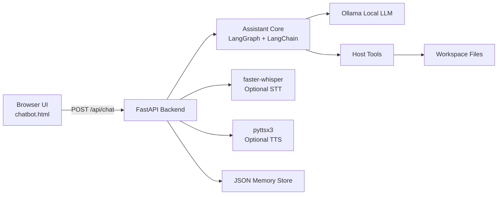
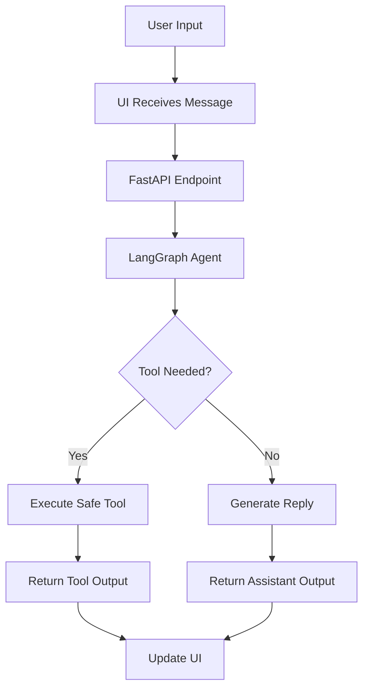

# Lofty Terminal — Local-First AI Assistant


[](https://www.python.org/)
[](https://fastapi.tiangolo.com/)
[](https://ollama.com/)
[](https://langchain-ai.github.io/langgraph/)
[](https://python.langchain.com/)

**Lofty** is a local-first AI assistant built to feel fast, private, and highly usable. It combines a FastAPI backend, a cinematic terminal-style web UI, a tool-aware agent flow, optional voice input, and local memory to create a complete assistant system that runs on your machine.

---

## Project Overview

Lofty is designed as a practical desktop-style assistant with a strong developer focus. It can chat, call tools, manage files, open applications, and support optional speech-to-text and text-to-speech. The interface is intentionally minimal and terminal-inspired, while the backend remains modular and easy to extend.

This project is aimed at real productivity use, not just demo interaction. The assistant can be connected to local models through Ollama, and the tool graph can safely execute approved host actions such as app launching, file operations, and browser actions.

---

## Core Ideas

* Local-first assistant with no dependency on cloud LLMs by default
* FastAPI backend for routing, UI delivery, and assistant endpoints
* Ollama integration for running local models
* LangGraph orchestration for tool-aware assistant behavior
* LangChain integration for model and tool bindings
* JSON-backed memory for persistence across sessions
* Optional voice transcription and TTS
* Safe host tools with workspace restrictions and confirmation flow

---

## Key Features

* Conversational assistant interface with terminal-style UI
* Tool-aware model flow for actionable requests
* Open applications on Windows and other supported environments
* Read and write files in a controlled workspace
* Web link launching and command execution support
* Memory storage for preferences and session context
* Optional voice interaction using `faster-whisper`
* Optional spoken replies using `pyttsx3`
* Modular backend wrappers for cleaner expansion
* Responsive frontend with cards, voice controls, and theme support

---

## Technology Stack

### Backend

* Python
* FastAPI
* Uvicorn
* LangChain
* LangGraph
* Ollama

### Voice

* faster-whisper
* pyttsx3

### UI

* HTML
* CSS
* JavaScript
* Terminal-inspired frontend layout

### Storage

* JSON memory file
* Workspace-scoped file operations

---

## Architecture



---

## Workflow



---

## Assistant Flow

1. User types or speaks.
2. Frontend sends the request to FastAPI.
3. The assistant core builds context from memory.
4. Ollama generates a response or tool call.
5. LangGraph routes the request through the correct node.
6. Safe tools are executed if needed.
7. The final response is returned to the UI.
8. Optional TTS speaks the response.

---

## Components

### API Layer

Responsible for:

* chat endpoint handling
* voice endpoints
* static file delivery
* frontend serving
* assistant orchestration

### Assistant Core

Responsible for:

* model binding
* message routing
* tool execution
* context preparation
* response generation

### Tool Layer

Responsible for:

* opening applications
* reading and writing files
* launching URLs
* workspace-safe actions
* optional shell operations

### Memory Layer

Responsible for:

* saving preferences
* session context
* user settings
* reusable state across sessions

### UI Layer

Responsible for:

* terminal-style chat interface
* clickable controls
* voice buttons
* theme support
* intro video support

---

## Core Concepts

### Local Model Execution

Lofty is designed to run with Ollama so the assistant can operate locally without requiring cloud inference for basic use cases.

### Tool Graph

The tool graph allows the assistant to decide when to answer directly and when to call a tool for actions such as opening a file, launching an app, or interacting with the system.

### Memory

Preferences and key session details are stored in a JSON file so the assistant can become more personalized over time.

### Safety

Sensitive actions are gated by confirmation and workspace rules to reduce accidental file or system modifications.

### Voice Support

Voice input and spoken replies are optional modules that can be enabled when the needed packages are installed.

---

## UI Assets and Visual Collateral

Add your project visuals here:

* `assets/banner.jpg` — main project banner
* `assets/intro.mp4` — intro video for the terminal UI
* `assets/stickers/` — modern digital stickers
* `assets/badges/` — branded badges and labels
* `assets/screenshots/` — product screenshots
* `assets/covers/` — video/image cover art

### Suggested stickers

* local-first
* voice-ready
* tool-aware
* memory-enabled
* privacy-focused
* workspace-safe
* automation
* offline-capable

### Suggested badges

* FastAPI powered
* Ollama local model
* LangGraph workflow
* Voice enabled
* Memory support
* Tool execution
* Windows ready
* Privacy first

---

## Video and Image Placement

If you want a modern README with strong visual impact, add:

* one hero banner at the top
* one short product video near the overview
* one screenshot showing the terminal UI
* one architecture image or diagram
* one collage of badges/stickers at the end

Recommended layout order:

1. Banner
2. Badges
3. Short overview
4. Feature blocks
5. Architecture diagram
6. Workflow diagram
7. Screenshots / video
8. Setup
9. Testing
10. Roadmap

---

## Setup

### 1. Install dependencies

```bash
pip install -r requirements_lofty_backend.txt
```

### 2. Install Ollama

Download and install Ollama, then pull a model:

```bash
ollama pull qwen3:4b
```

### 3. Run the backend

```bash
uvicorn lofty_backend_enhanced:app --reload --host 0.0.0.0 --port 8000
```

Or:

```bash
python lofty_backend_enhanced.py
```

### 4. Open the UI

Open your browser at:

```text
http://127.0.0.1:8000/
```

---

## Testing

### Syntax checks

```bash
python -m py_compile lofty_backend_enhanced.py tools.py
```

### Import smoke test

```bash
python -c "import lofty_backend_enhanced, tools; print('imports ok')"
```

### Voice stack check

```bash
python -c "import sounddevice, faster_whisper, numpy, scipy; print('voice ok')"
```

---

## Safety Notes

* File writing is restricted to the approved workspace.
* Risky actions should require confirmation.
* Shell commands should be limited and reviewed.
* Tool execution should never silently perform destructive actions.
* Model responses should not be trusted for system-critical actions without validation.

---

## Directory Structure

```text
project/
├── lofty_backend_enhanced.py
├── tools.py
├── lofty_backend/
│   ├── __init__.py
│   ├── assistant.py
│   ├── config.py
│   ├── memory.py
│   └── utils.py
├── templates/
│   └── chatbot.html
├── assets/
│   ├── banner.jpg
│   ├── intro.mp4
│   ├── stickers/
│   └── badges/
├── lofty_memory.json
├── requirements_lofty_backend.txt
└── README.md
```

---

## Troubleshooting

### Ollama not connecting

Make sure Ollama is running locally and the base URL matches your configuration.

### Voice not ready

Install the voice packages and confirm that the app and terminal are using the same Python interpreter.

### App launch fails

Some applications on Windows may require exact executable paths rather than aliases.

### File errors

Ensure the file exists inside the workspace and that the assistant is allowed to access it.

---

## Roadmap

* Split the backend into smaller modules
* Add more tool categories
* Expand memory capabilities
* Improve voice flow and latency
* Add richer UI states and themes
* Add tests and CI checks
* Package for desktop distribution
* Improve screenshot, banner, and sticker assets

---

## Why This Project Matters

Lofty is built as a serious local assistant system that combines model orchestration, tools, voice, memory, and a premium interface. It is designed to demonstrate product thinking, backend engineering, automation logic, and polished UI/UX in one project.

---

## License

Choose a license for the repository and add a `LICENSE` file. Common options:

* MIT
* Apache-2.0

---

## Credits

Built with:

* Ollama
* LangChain
* LangGraph
* FastAPI
* faster-whisper
* pyt
